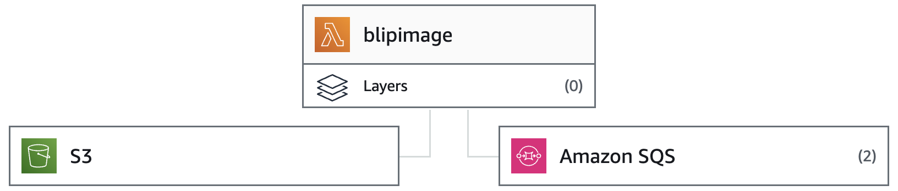
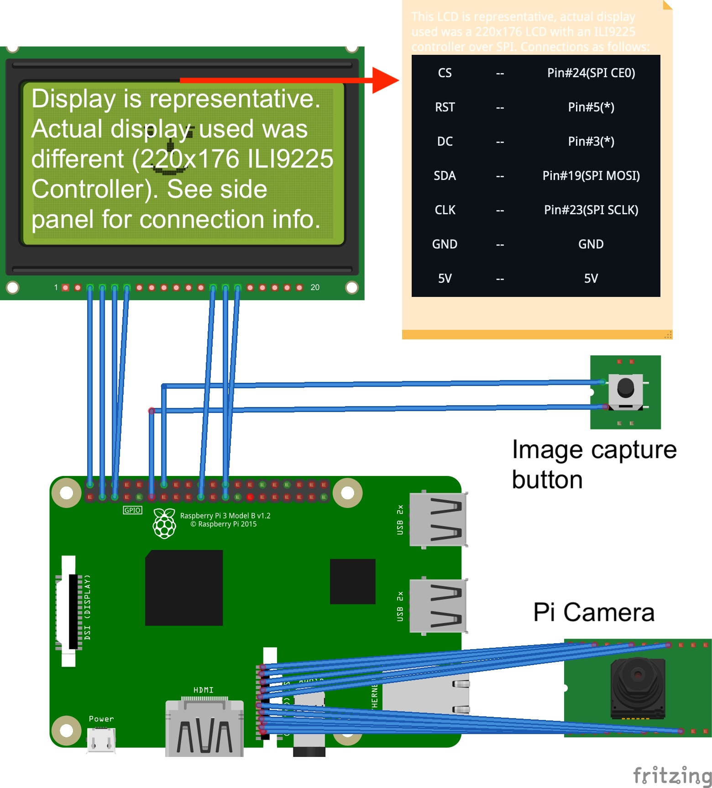
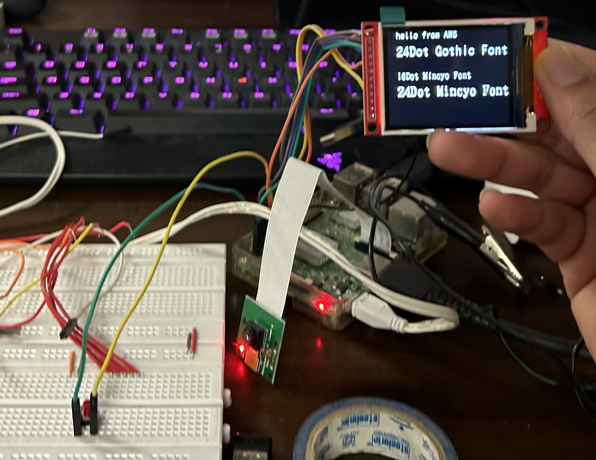

# Haiku Cam

## AWS Cloud Setup


The Haiku Cam backend uses a serverless architecture powered by AWS Lambda for processing images into poems. The Raspberry Pi captures an image using the attached camera and uploads it to an Amazon S3 storage bucket. This triggers an AWS Lambda function (*lambda_function.py*), which processes the image and sends the response to an SQS queue destination. The client side code running on the Raspberry Pi (*aws-hc.py*) polls the SQS queue and interfaces with the hardware to display the generated poem and a QR code, which users can scan to view the captured image stored in the S3 bucket.

### Create AWS Lambda deployment package
To create the deployment package for AWS Lambda, run the following commands in a new directory containing just *lambda_function.py* (at the same level as *lambda_function.py*):

```
pip install requests "urllib3<2" -t ./
zip -r deploy.zip ./
```

Upload *deploy.zip* to AWS Lambda.

### LCD interface
The *lcd_interface.c* file contains the code to interface with the 220x176 Liquid Crystal Display using the SPI communication protocol. The code uses some functionalities from the [Raspberry-ili9225spi library by nopnop2002](https://github.com/nopnop2002/Raspberry-ili9225spi). After installing this library, the lcd_interface executable can be compiled using the following command:
```
cc -o lcd_interface lcd_interface.c fontx.c ili9225.c -lbcm2835 -lm -lpthread
```

### Start Haiku Cam code on boot
The client side code is in *aws-hc.py* which runs on the Raspberry Pi in an infinite loop. To make the *aws-hc.py* file run on boot, a cron job was scheduled on the Raspberry Pi.

Use the following command to open crontab:
```
sudo crontab -e
```

And add the following entry:
```
@reboot sh /home/saarthak/Desktop/haiku_cam/launcher.sh > /home/saarthak/logs/cronlog 2>&1
```

### Local SQLite database
Haiku Cam uses a SQLite 3 database to store a record of the image links and the corresponding poems generated. Follow the following steps to setup the database:

Install SQLite:
```
sudo apt install sqlite3
```

Create the database and setup a table:
```
sqlite3 haiku.db
CREATE TABLE haiku(id INTEGER PRIMARY KEY AUTOINCREMENT, image TEXT, poem TEXT);
.quit
```

### QR code generation and display

The client side python code generates a QR code which links to the captured image on Amazon S3:
```
qr_code = generate_qr_code(image_s3_url)
qr_array = qr_to_array(qr_code)
flat_qr_array = [item for sublist in qr_array for item in sublist]
qr_str = ''.join([str(elem) for elem in flat_qr_array])
```

The QR code image is converted to a pixel array and passed to the C program as a binary string for display on the LCD:
```
int *binaryArray = (int *)malloc(length * sizeof(int));
for (size_t i = 0; i < length; i++) {
    binaryArray[i] = qr_array[i] - '0';
}

uint16_t xpos_qr = 176;
uint16_t ypos_qr = 150;

for(size_t i=0;i<ROWS;i++) {
    for(size_t j=0;j<COLS;j++) {
        int px_val = binaryArray[i*ROWS+j];
        if(px_val == 0) {
            lcdDrawPixel(ypos_qr, xpos_qr, WHITE);
        }
        xpos_qr = xpos_qr - 1;
    }
    ypos_qr = ypos_qr - 1;
    xpos_qr = 176;
}

free(binaryArray);
return 0;
```

### Hardware setup
he hardware consists of a Raspberry Pi 3B running Raspbian GNU/Linux 11 (bullseye) connected to a Pi camera module, a button, and a 220x176 LCD display with an ILI9225 controller:




